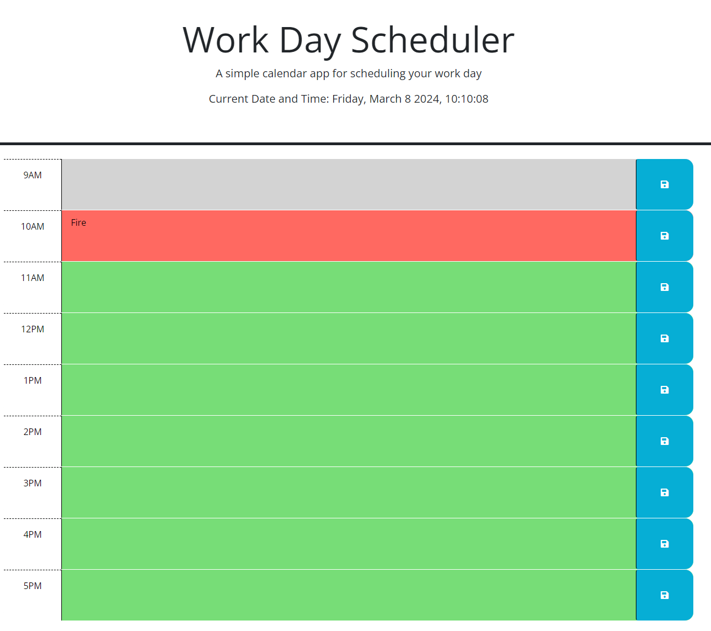

# Workdat Scheduler ()
## Description
This simple  scheduler adds clarity to you daily timeboxing. It spans ever the typical working hours: 9am - 5pm. The grey block(s) are past, the red block represents the current hour  and the green block(s) represent upcoming hours. The visual cues allow you to quickly and efficiently navigate through your tasks and events.

This project stems from wanting to practce time boxing. As a father and a student tasks can easily overlap each other. This simple web application helps keep my task in order.

## Installation

1. Clone the repository to your local machine, https://github.com/ralphmolu/workday_scheduler
 
2. Open the project directory in your code editor.

3. Open the index.html file using any browser.

## Usage

The application can be used within any browser. Once opened you can start storing your tasks and events

## Contributing
Contributions are welcome! If you'd like to contribute to this project, please follow these steps:
1. Fork the repository.
2. Create a new branch (`git checkout -b feature/your-feature-name`).
3. Make your changes.
4. Commit your changes (`git commit -am 'Add new feature'`).
5. Push to the branch (`git push origin feature/your-feature-name`).
6. Create a new Pull Request.

## Licence

Refer to GitHub MIT License.

## Contact
If you have any questions or suggestions, feel free to contact me at rmolu11@gmail.com
